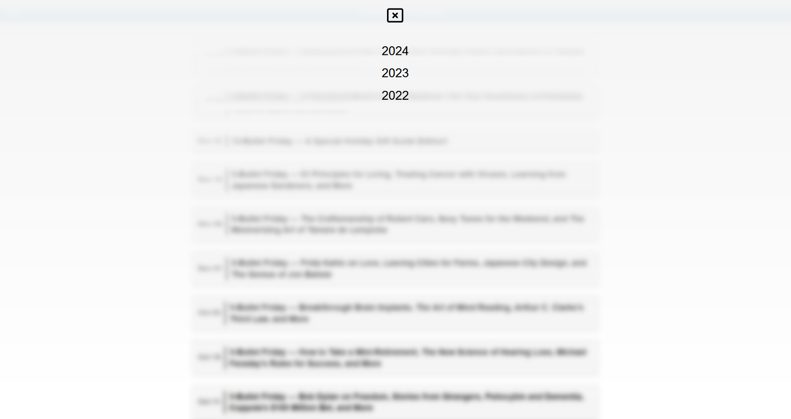

# 📬 5-Bullet Friday Archive

A Python + Django web app that archives Tim Ferriss' 5-Bullet Friday newsletter emails. ETL Automation Script for TFF Friday Email content can be found here - [Tim Ferriss 5-Bullet Friday Email Automation](https://github.com/vatsal2297/TimFerrissFridayAutomation)

---

## 📸 Screenshots

<!-- Replace with correct paths once screenshots are uploaded -->
  
*Landing page with recent 5-Bullet Fridays listed*

  
*Detailed bullet breakdown with links*

  
*Years filters in action*

---

## 🧱 Tech Stack

- **Backend:** Python, MySQL  
- **Frontend:** Django (HTML, CSS, JavaScript)  
- **Scheduler:** Windows Task Scheduler  

---

## 🎯 Use Case

This project is perfect for anyone who enjoys Tim Ferriss' content and wants a personal searchable archive of all his recommendations, tools, and inspirations — right on their desktop. I will be deploying this online soon after I gather old emails as well.

---

## 📝 Future Improvements

- Tag-based filtering (e.g. Books, Gadgets, Quotes) and Searching   
- Export options (PDF, JSON)  
- Mobile-responsive UI

---

## 🙌 Acknowledgements

- Inspired by [Tim Ferriss](https://tim.blog/) and his *5-Bullet Friday* newsletter  
